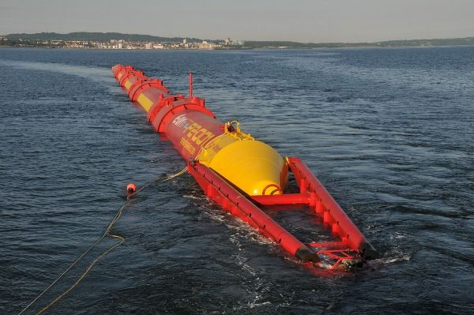

# Wave power conversion devices
The patent literature is full of devices for extracting energy from waves, i.e., floats, ramps,
and flaps, covering channels. Small generators driven from air trapped by the rising and
falling water in the chamber of a buoy are in use around the world (Swift-Hook, et al, 2007).
Wave power is one possibility that has been selected. Figure 4 shows the many other aspects
that will need to be covered. A wave power programme would make a significant
contribution to energy resources within a relatively short time and with existing technology.
Wave energy has also been in the news recently. There is about 140 megawatts per mile
available round British coasts. It could make a useful contribution people needs, about twice
that of the UK generating system is available provided. Although very large amounts of
power are available in the waves, it is important to consider how much power can be
extracted. A few years ago only a few percent efficiency had been achieved. Recently,
however, several devices have been studied which have very high efficiencies. Some form of
storage will be essential on a second-to-second and minute-to-minute basis to smooth the
fluctuations of individual waves and wave’s packets but storage from one day to the next
will certainly not be economic. This is why provision must be made for adequate standby
capacity.

The increased availability of reliable and efficient energy services stimulates new
development alternatives. This article discusses the potential for such integrated systems in
the stationary and portable power market in response to the critical need for a cleaner
energy technology. Anticipated patterns of future energy use and consequent
environmental impacts (acid precipitation, ozone depletion and the greenhouse effect or
global warming) are comprehensively discussed in this paper. Throughout the theme
several issues relating to renewable energies, environment and sustainable development are
examined from both current and future perspectives. It is concluded that renewable
environmentally friendly energy must be encouraged, promoted, implemented and
demonstrated by full-scale plan especially for use in remote rural areas.
Globally, buildings are responsible for approximately 40% of the total world annual energy
consumption. Most of this energy is for the provision of lighting, heating, cooling, and air
conditioning. Increasing awareness of the environmental impact of CO2 and NOx emissions
and CFCs triggered a renewed interest in environmentally friendly cooling, and heating
technologies. Under the 1997 Montreal Protocol, governments agreed to phase out chemicals
used as refrigerants that have the potential to destroy stratospheric ozone. It was therefore
considered desirable to reduce energy consumption and decrease the rate of depletion of
world energy reserves and pollution of the environment. One way of reducing building
energy consumption is to design buildings, which are more economical in their use of
energy for heating, lighting, cooling, ventilation and hot water supply. Passive measures,
particularly natural or hybrid ventilation rather than air-conditioning, can dramatically
reduce primary energy consumption. However, exploitation of renewable energy in
buildings and agricultural greenhouses can, also, significantly contribute towards reducing
dependency on fossil fuels. Therefore, promoting innovative renewable applications and
reinforcing the renewable energy market will contribute to preservation of the ecosystem by
reducing emissions at local and global levels. This will also contribute to the amelioration of
environmental conditions by replacing conventional fuels with renewable energies that
produce no air pollution or greenhouse gases. The provision of good indoor environmental
quality while achieving energy and cost efficient operation of the heating, ventilating and
air-conditioning (HVAC) plants in buildings represents a multi variant problem. The
comfort of building occupants is dependent on many environmental parameters including
air speed, temperature, relative humidity and quality in addition to lighting and noise. The
overall objective is to provide a high level of building performance (BP), which can be
defined as indoor environmental quality (IEQ), energy efficiency (EE) and cost efficiency
(CE).
# Ethanol production
Alternative fuels were defined as methanol, ethanol, natural gas, propane, hydrogen, coalderived liquids, biological material and electricity. The fuel pathways currently under development for alcohol fuels are shown in Figure 5. The production of agricultural biomass and its exploitation for energy purposes can contribute to alleviate several problems, such as
the dependence on import of energy products, the production of food surpluses, the
pollution provoked by the use of fossil fuels, the abandonment of land by farmers and the
connected urbanisation. Biomass is not at the moment competitive with mineral oil, but,
taking into account also indirect costs and giving a value to the aforementioned advantages,
public authorities at national and international level can spur its production and use by
incentives of different nature. In order to address the problem of inefficiency, research
centres around the world have investigated the viability of converting the resource to a
more useful form, namely solid briquettes and fuel gas (Figure 6).
The main advantages are related to energy, agriculture and environment problems, are
foreseeable both at regional level and at worldwide level and can be summarised as follows:
 Reduction of dependence on import of energy and related products.
 Reduction of environmental impact of energy production (greenhouse effect, air
pollution, and waste degradation).
 Substitution of food crops and reduction of food surpluses and of related economic
burdens, and utilisation of marginal lands and of set aside lands.
 Reduction of related socio-economic and environmental problems (soil erosion,
urbanisation, landscape deterioration, etc.).
 Development of new know-how and production of technological innovation.
The convention on Biological Diversity set conservation of biodiversity on the world
agenda. Gaps in knowledge need to be addressed for actions to be effective and sustainable.
Gaps include: species diversity, microorganisms and their ecological roles, ecological and
geographical status of species, human capacity to access and forecast bio-ecological
degradation. Requirements for global inventories call for worldwide collaboration. Criteria
for setting priorities need to be formulated and agreed. Global inventorying needs a
collaborative international effort, perhaps under the aegis of the Convention on Biological
Diversity. The recently formulated global taxonomy initiatives are a step in the right
direction. 

